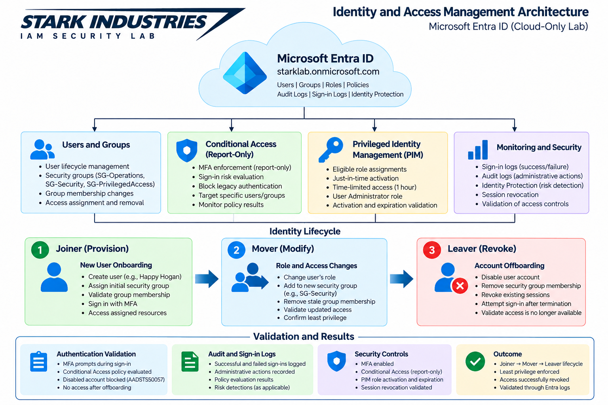
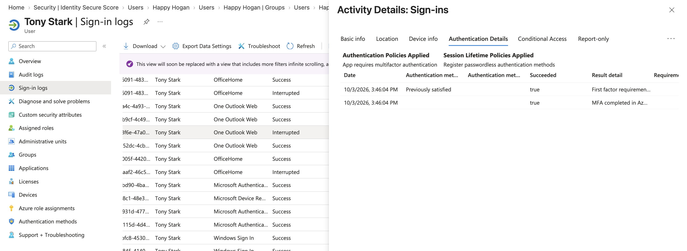
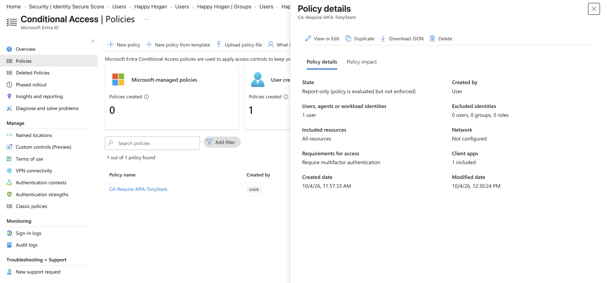
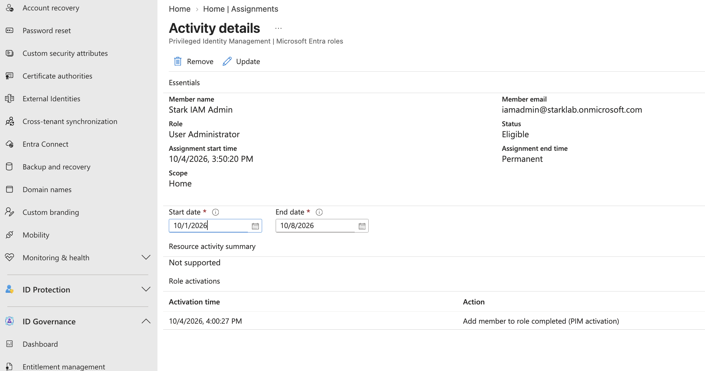
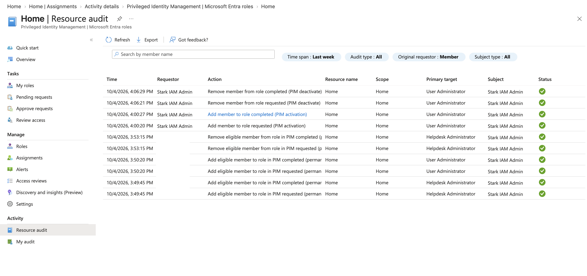
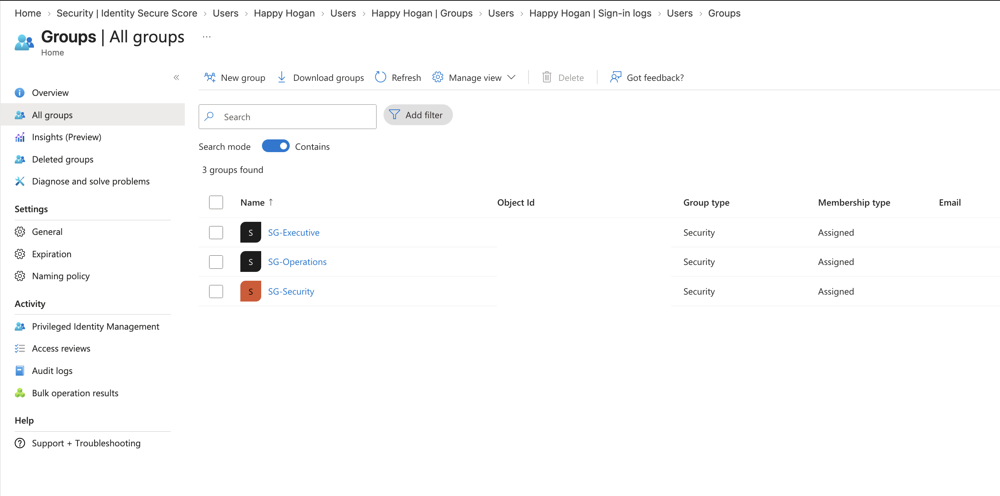
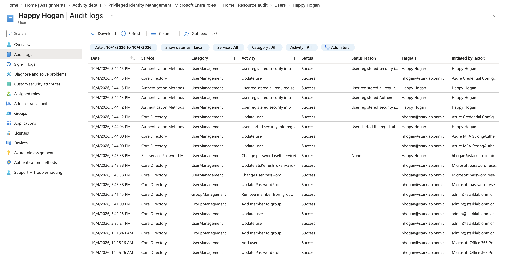
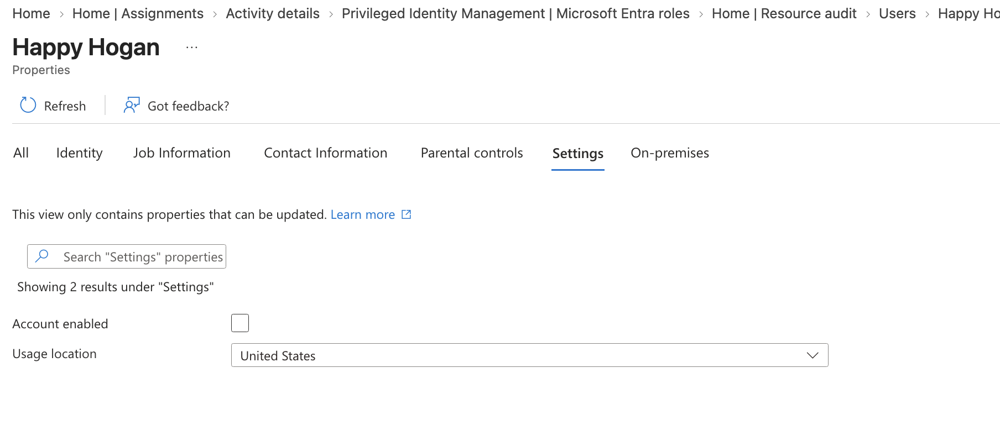
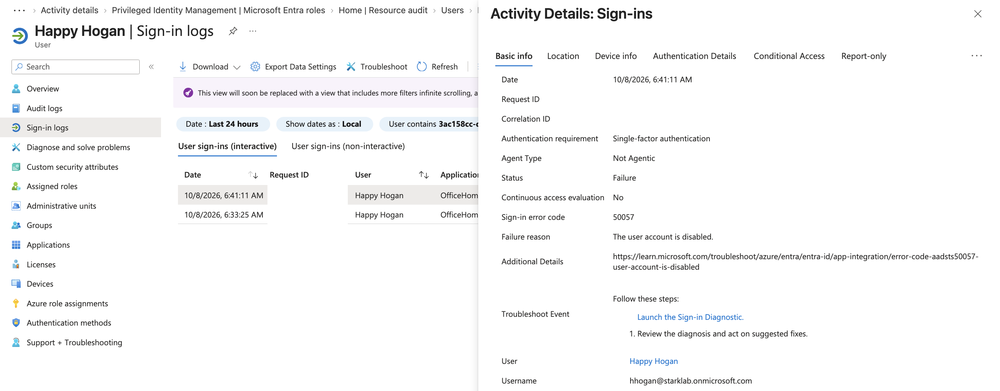
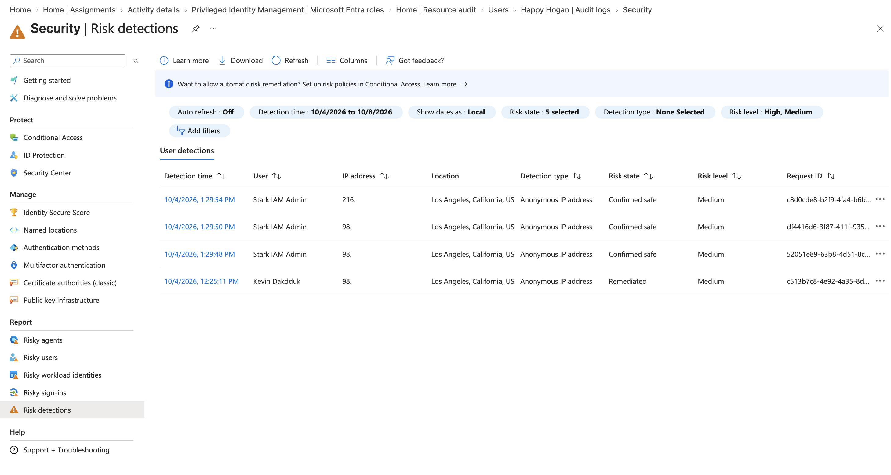

# Stark Industries — Identity & Access Management (IAM) Security Lab

## Overview

This project demonstrates hands-on Identity and Access Management (IAM) security practices using Microsoft Entra ID in a controlled, fictional Stark Industries environment.

The lab implements and validates the identity lifecycle:

**Provision → Authenticate → Authorize → Monitor → Modify → Revoke → Validate**

The project focuses on identity security, least-privilege access, privileged role management, authentication controls, security monitoring, and employee offboarding.

All configuration and testing were performed through Microsoft Entra administrative interfaces.

## Objectives

- Implement a Joiner → Mover → Leaver identity lifecycle.
- Configure and validate multifactor authentication (MFA).
- Configure a targeted Conditional Access policy in report-only mode.
- Demonstrate role-based access control and least-privilege principles.
- Configure and test Microsoft Entra Privileged Identity Management (PIM).
- Investigate authentication activity using sign-in and audit logs.
- Investigate identity risk detections using Microsoft Entra ID Protection.
- Identify and remove outdated group memberships.
- Disable an account, revoke sessions, and validate blocked authentication.

## Environment

### Microsoft Cloud

- Microsoft Entra ID
- Microsoft Entra ID P2
- Microsoft Entra Conditional Access
- Microsoft Entra Privileged Identity Management (PIM)
- Microsoft Entra ID Protection

### Administration

- Microsoft Entra admin center
- Web browser

### Lab Identities

- **Tony Stark** — Standard user used for authentication security testing
- **Happy Hogan** — User used for Joiner → Mover → Leaver lifecycle testing
- **Stark IAM Admin** — Dedicated privileged identity used for PIM testing

### Security Groups

- `SG-Operations`
- `SG-Security`
- `SG-Executive`

## Architecture

The architecture diagram illustrates the Microsoft Entra identity environment, employee identity lifecycle, privileged access controls, and monitoring capabilities.

The diagram is a conceptual representation of the lab. Conditional Access was configured in report-only mode and was not enforced.

## Implementation

### 1. Identity Foundation and Access Management

Established a small identity environment using Microsoft Entra ID.

Activities included:

- Created dedicated standard and administrative test identities.
- Configured security groups representing organizational responsibilities.
- Assigned group memberships based on simulated job functions.
- Reviewed account properties and group memberships through the Entra admin center.

**Security principle:** Access should be assigned according to job responsibilities and reviewed when those responsibilities change.

### 2. Authentication Security

Configured and tested multifactor authentication for Tony Stark.

Activities included:

- Configured MFA for the test identity.
- Performed authentication testing.
- Reviewed authentication details in Microsoft Entra sign-in logs.
- Validated successful authentication satisfying MFA requirements.

Configured a targeted Conditional Access policy:

| Configuration | Value |
|---|---|
| Policy | `CA-Require-MFA-TonyStark` |
| Target | Tony Stark |
| Resources | All resources |
| Grant control | Require multifactor authentication |
| Policy state | Report-only |

**Validation:** Sign-in evidence confirmed successful MFA authentication. The Conditional Access policy was configured for evaluation only, not enforcement.

### 3. Privileged Identity Management

Configured Microsoft Entra Privileged Identity Management to demonstrate temporary administrative access.

Activities included:

- Used a dedicated privileged identity: Stark IAM Admin.
- Configured an eligible **User Administrator** role assignment.
- Activated the role temporarily through PIM.
- Performed an administrative password reset during the activation period.
- Reviewed PIM activity and deactivation records.
- Removed an unnecessary Helpdesk Administrator role assignment.

**Validation:** PIM audit records showed successful User Administrator activation and subsequent deactivation.

This demonstrated the distinction between permanent administrative privileges and eligible, just-in-time role activation.

### 4. Joiner → Mover → Leaver Lifecycle

Simulated an employee identity lifecycle using Happy Hogan.

#### Joiner — Provisioning

- Created Happy Hogan's Microsoft Entra user account.
- Assigned Operations-related user attributes.
- Added the account to `SG-Operations`.
- Validated the initial group membership.

#### Mover — Role Change

Simulated Happy Hogan transferring from Operations to Security.

- Updated the user's job-related attributes.
- Added the account to `SG-Security`.
- Identified the remaining `SG-Operations` membership as outdated access.
- Removed the outdated membership.
- Validated the resulting group membership.

#### Leaver — Access Revocation

Simulated Happy Hogan leaving Stark Industries.

- Disabled the Microsoft Entra user account.
- Removed the remaining `SG-Security` membership.
- Revoked existing sign-in sessions.
- Attempted authentication after account termination.
- Reviewed the resulting sign-in failure.

**Validation:** The final authentication test returned `AADSTS50057`, confirming that Microsoft Entra rejected the sign-in because the user account was disabled.

### 5. Identity Monitoring and Security Investigation

Reviewed Microsoft Entra sign-in logs, audit logs, and Identity Protection risk detections.

#### Investigation A — Authentication Interruption

Investigated an interrupted Happy Hogan sign-in.

- Observed error `AADSTS50055`, associated with an expired password.
- Reviewed subsequent password-change activity in Microsoft Entra audit logs.
- Verified that a later authentication attempt succeeded.

**Finding:** The interruption was associated with the account's temporary password requiring a change, rather than a confirmed security incident.

#### Investigation B — Identity Protection Risk Detection

Investigated Medium-risk detections associated with the Stark IAM Admin identity.

- Reviewed three Anonymous IP address detections.
- Examined the associated sign-in locations and timestamps.
- Identified Los Angeles-based IP addresses.
- Correlated the activity with authorized administrative testing performed through a Los Angeles-based VPN.
- Submitted confirmation that the user was safe.
- Verified the resulting **Confirmed safe** risk state.

**Finding:** The detections were consistent with authorized VPN activity. No account compromise was established during the investigation.

## Troubleshooting

### PIM Role Assignment Failure

**Issue:** Attempts to configure privileged role assignments returned a "Role not found" error.

**Investigation:** Reviewed the PIM configuration and repeated the operation. The issue was ultimately isolated to the active VPN connection.

**Resolution:** Disconnected the VPN and successfully completed the PIM role assignment.

**Lesson:** Network routing, VPN connections, and administrative portal behavior can affect cloud management workflows. Environmental factors should be considered before changing role configurations or permissions.

### Interrupted Authentication

**Issue:** Happy Hogan's initial authentication attempt was interrupted.

**Investigation:** Reviewed sign-in error `AADSTS50055` and correlated the event with password-change audit activity.

**Resolution:** The temporary password was changed during the authentication process, and a subsequent sign-in succeeded.

### Offboarding Authentication Validation

**Issue:** An initial post-termination authentication attempt returned `AADSTS50126`, indicating an incorrect username or password.

**Investigation:** Determined that an outdated password had been used during testing.

**Resolution:** Repeated authentication using the correct password.

**Validation:** The subsequent sign-in returned `AADSTS50057`, confirming that the account was disabled.

## Validation Results

| Security Control | Validation | Result |
|---|---|---|
| User provisioning | Created Happy Hogan and assigned initial group access | Passed |
| MFA | Reviewed successful MFA authentication evidence | Passed |
| Conditional Access | Verified targeted policy configuration in report-only mode | Configured; not enforced |
| Privileged access | Reviewed PIM activation and deactivation records | Passed |
| Role transition | Removed outdated Operations membership after Security transfer | Passed |
| Sign-in monitoring | Investigated interrupted and successful authentication events | Passed |
| Audit monitoring | Reviewed user, password, and group membership changes | Passed |
| Identity Protection | Investigated VPN-related risk detections and verified confirmed-safe state | Passed |
| Account disabling | Verified Happy Hogan's account was disabled | Passed |
| Session revocation | Issued session revocation during offboarding | Completed |
| Post-termination authentication | Observed `AADSTS50057` account-disabled failure | Passed |

**Validation scope:** These results reflect controlled testing in a lab tenant. Session revocation was performed administratively; the project did not measure expiration of every previously issued access token.

## Lessons Learned

1. **Identity lifecycle management requires continuous access review.** Provisioning correct initial access is only one part of IAM. Role changes and employee departures require authorization updates and validation.

2. **Authentication and authorization are separate controls.** Successful authentication does not automatically establish that a user should have access to a particular resource.

3. **Privileged access should be limited.** PIM eligible assignments and temporary activation provide a practical way to demonstrate just-in-time administrative access.

4. **Security alerts require investigation and context.** VPN activity can produce suspicious-looking sign-in patterns. Reviewing timestamps, locations, and known activity helps distinguish benign events from potential threats.

5. **Audit logs provide essential evidence.** Sign-in logs explain authentication outcomes, while audit logs help reconstruct changes to identities, permissions, and security configurations.

6. **Access revocation should be tested.** Disabling an account, removing group memberships, and revoking sessions should be followed by validation rather than assuming the controls worked.

7. **Cloud troubleshooting includes environmental factors.** The PIM assignment issue demonstrated the importance of checking VPN connectivity before making unnecessary configuration changes.

## Evidence

The `screenshots/` directory contains selected evidence from the completed lab.

| File | Evidence |
|---|---|
| `01-entra-security-groups.png` | Security group configuration |
| `02-mfa-authentication.png` | Successful MFA authentication |
| `03-conditional-access-report-only.png` | Targeted Conditional Access policy |
| `04-pim-eligible-assignment.png` | PIM eligible role evidence |
| `05-pim-role-activation.png` | PIM activation and deactivation history |
| `06-joiner-mover-group-changes.png` | Identity lifecycle audit events |
| `07-identity-protection-risk.png` | VPN-related Identity Protection detections |
| `08-happy-hogan-disabled.png` | Disabled user account |
| `09-disabled-account-signin.png` | `AADSTS50057` authentication failure |

## Project Status

**Status: Technical implementation complete — portfolio documentation finalization**

All planned technical scenarios have been completed. Final repository organization, evidence upload, and documentation review are in progress.

See [`PROJECT-TRACKER.md`](PROJECT-TRACKER.md) for the project checklist.

---

**Disclaimer:** This repository documents hands-on experience in a controlled Microsoft Entra lab environment. It does not represent production deployment, professional enterprise IAM administration, or investigation of a confirmed real-world security incident.
